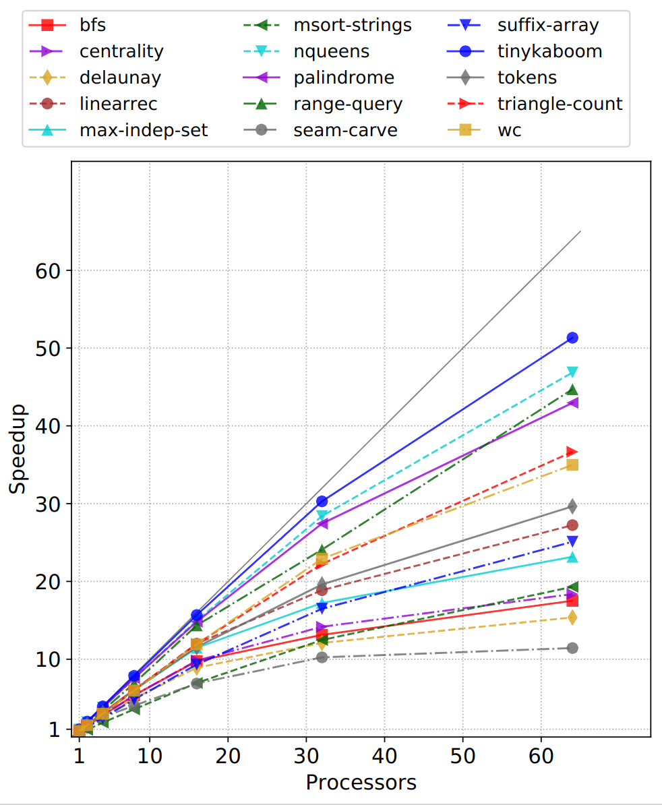
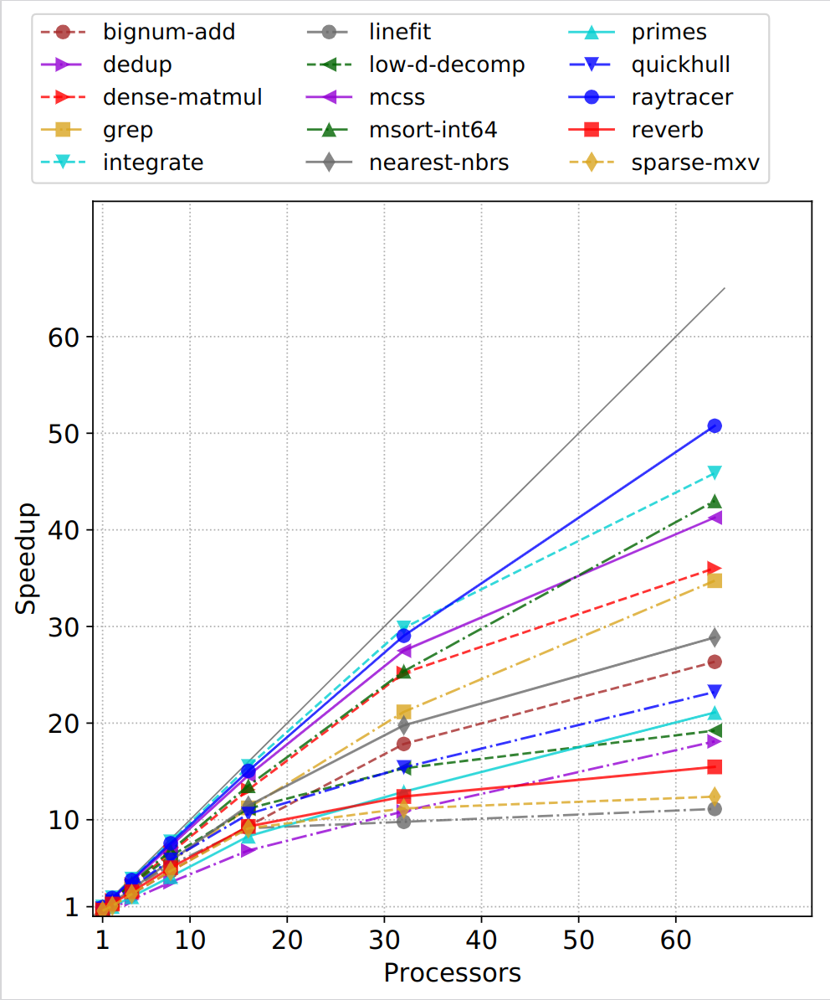
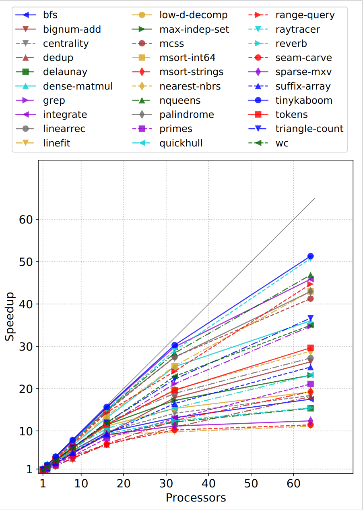

# MPLLang

## Overview

并行程序的常见性能问题

- amount of _parallelizable_ work
- task granularity (scheduling chunk size)
- load balancing (tasks on each processor)
- memory management and GC (reduce unnecessary allocation, gc stopping time & sync, etc.)
  + FP²: Fully in-Place Functional Programming (ICFP '23)
    * 即使是 GC，减少分配也是有意义的
    * 在并行环境下，判断是否可以 reuse 需要判断 uniqueness (?)，最简单的方法可能就是引用计数，运行时读一下
    * Koka 处理并行，对象里加个状态判断是否被 shared
    * MaPLe 使用了 copy GC，相比引用能减少内存碎片 (?)
  + Parallelism in a Region Inference Context (PLDI '23)
    * 给程序推断出显示的 region memory 标注，不依赖 GC (可以用资源分析做得更好吗？)
    * 利用 region 标注减少 allocation 时需要加锁/同步的情况
    * Integrating region memory management and tag-free generational garbage collection (JFP '21)
  + Concurrent and parallel garbage collection for lightweight threads on multicore processors (ISMM '22)
    * on-the-fly collection that does not stop any thread

- cache & locality (access locality for each processor & cache invalidation across processors)
  + Efficient tree-traversals: reconciling parallelism and dense data representations (ICFP '21)
    * 紧凑的 ADT 内存表示，加速 _树遍历_ 操作
    * regional 内存管理 + 引用计数
  + WARDen: Specializing Cache Coherence for High-Level Parallel Languages (CGO '23)


目前能做什么？

### Other Related/Interesting Materials

- Responsiveness (Latency)
  + Responsive Parallelism with Synchronization (POPL '23)

- Cost Analysis for parallelism

- Parallel Algorithms
  + Many Sequential Iterative Algorithms Can Be Parallel and (Nearly) Work-efficient (SPAA '22)
    * The goal is to achieve $\tilde{O}(D)$ span for a problem with the deepest dependence length $D$ We refer to this property as _round-efficiency_
    * Type 1 algorithms aim to use range queries to extract all objects with the same rank to avoid evaluating all the dependences -- activity selection, and Dijkstra’s algorithm.
    * Type 2 algorithms aim to wake up an object when the last object it depends on is finished --  activity selection, longest increasing subsequence (LIS), greedy maximal independent set (MIS)

## Examples

Tree Scan

```sml
fun scan (f: 'a * 'a -> 'a) (id: 'a) (t: 'a tree) =
  let
    (** "sum tree" is produced by the first phase of the algorithm,
      * the "upsweep", which is essentially the same as a reduce except that
      * it produces a tree which stores all intermediate results.
      *)
    datatype 'a sum_tree =
        EmptySum
      | LeafSum of 'a
      | NodeSum of 'a * 'a sum_tree * 'a sum_tree

    fun sumOf (st: 'a sum_tree) : 'a =
      case st of
        EmptySum => id
      | LeafSum x => x
      | NodeSum (x, _, _) => x

    fun upsweep (t: 'a tree): 'a sum_tree =
      case t of
        Empty => EmptySum
      | Leaf x => LeafSum x
      | Node (_, left, right) =>
          let
            val (leftSums, rightSums) =
              ForkJoin.par (fn _ => upsweep left, fn _ => upsweep right)
            val thisSum = f (sumOf leftSums, sumOf rightSums)
          in
            NodeSum (thisSum, leftSums, rightSums)
          end


    fun downsweep acc (t: 'a tree) (st: 'a sum_tree): ('a tree * 'a) =
        case (t, st) of
          (Empty, EmptySum) => (Empty, id)
        | (Leaf x, LeafSum _) => (Leaf (f (acc, x)), f (acc, x) )
        | (Node (n, left, right), NodeSum (_, stLeft, stRight)) =>
            let
              val accLeft = f (acc, sumOf stLeft)

              val ((l, _), (r, accTotal)) =
                ForkJoin.par (fn _ => downsweep acc left stLeft,
                              fn _ => downsweep accLeft right stRight)
            in
              (Node (n, l, r), accTotal)
            end
          | _ => raise Fail "Tree.scan.downsweep: impossible"

  in
    downsweep id t (upsweep t)
  end
```

Binary Trees

```c
#include <stdio.h>
#include <stdlib.h>

typedef struct t {
   struct t* left;
   struct t* right;
} Tree;

Tree* new_tree(Tree* left, Tree* right) {
   Tree* new = (Tree*)malloc(sizeof(Tree));
   new->left = left;
   new->right = right;
   return new;
} 

Tree* tree_with(int depth) {
   return (depth == 0) 
      ? new_tree(NULL, NULL)
      : new_tree( tree_with(depth-1), tree_with(depth-1));
}

long node_count(Tree* t) {
   if (t->left == NULL)
      return 1;
   else
      return 1 + node_count(t->left) + node_count(t->right);
}

void clear(Tree* t) {
   if (t->left != NULL) {
      clear(t->left);   
      free(t->left);      
      clear(t->right); 
      free(t->right);       
   }
}

int count(int depth) {
   Tree *t = tree_with(depth);
   int c = node_count(t);  
   clear(t);
   return c;
}

void stretch(int depth) {  
   printf ("stretch tree of depth %i\t check: %i\n", depth, count(depth));   
}

int main(int argc, char *argv[]) {
   int n = 10;
   if (argv[1] > 0) n = atoi(argv[1]);

   int min_depth = 4;
   int max_depth = (min_depth + 2 > n) ? min_depth + 2 : n;
   int stretch_depth = max_depth + 1;

   stretch(stretch_depth);   
   Tree *long_lived_tree = tree_with(max_depth);
		
	 // parallel for at here for ocaml
   for (int depth = min_depth; depth <= max_depth; depth += 2) {
      int iterations = 1 << (max_depth - depth + min_depth);      
      int sum = 0;
      for (int i = 1; i <= iterations; i++) {
         sum += count(depth);
      }         
      printf ("%i\t trees of depth %i\t check: %i\n", 
         iterations, depth, sum);                 
   }
   int c = node_count(long_lived_tree);
   clear(long_lived_tree);   
   printf ("long lived tree of depth %i\t check: %i\n", 
      max_depth, c); 
   
   return 0;
}
    
```


## Benchmark

Other Benchmarks from mpl-tutorial

- tree scan
- sequence filter
- Knuth shuffle
- radix sort
- quick sort

Benchmark suite

<center>
  
</center>

<center>
  
</center>

### MPL parallelism (Manual Tuned)

time in seconds

| Benchmark          | MPL T1 |  MPL T2 | MPL T4 | MPL T8  | MPL T16 | MPL T32 | MPL T64 |
| --- | --- | --- | --- | --- | --- | --- | --- |
| tree-scan-balanced | 0.022  | 0.007   | 0.003  | 0.0032  | 0.0032  | 0.0025  | 0.0029  |
| tree-scan-unbalance| 0.053  | 0.030   | 0.032  | 0.038   | 0.029   | 0.025   | 0.023   |

### MPL fully parallelism

time in seconds

| Benchmark          | MPL T1 |  MPL T2 | MPL T4 | MPL T8  | MPL T16 | MPL T32 | MPL T64 |
| --- | --- | --- | --- | --- | --- | --- | --- |
| tree-scan-balanced | 0.077  | 0.195   | 0.011  | 0.0043  | 0.0044  | 0.0045  | 0.0048  |
| tree-scan-unbalance| 0.0483 | 0.027   | 0.036  | 0.0340  | 0.0292  | 0.00226 | 0.00237 |

